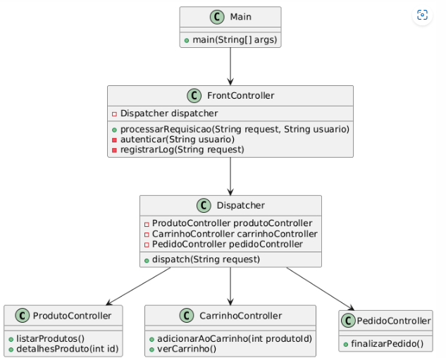

# Front Controller

## Motivação

Em uma aplicação web, várias requisições podem chegar ao servidor, como listar produtos, adicionar itens ao carrinho e finalizar compras. Sem um padrão como o Front Controller, cada requisição seria tratada por um controlador diferente, o que pode levar à duplicação de código e dificuldade de manutenção. O Front Controller centraliza o tratamento de todas as requisições em um único ponto, simplificando o fluxo e facilitando a adição de funcionalidades comuns, como autenticação e logging.

## UML:

## Participantes

### **Front Controller**
- Centraliza o tratamento de todas as requisições.
- **No código**: Classe FrontController.

### **Dispatcher**
- Encaminha a requisição para o controlador apropriado.
- **No código**: Classe Dispatcher.

### **Controladores**
- Classes que processam requisições específicas.
- **No código**: ProdutoController, CarrinhoController, PedidoController.

### **Cliente**
- Faz requisições ao sistema.
- **No código**: Classe Main.
